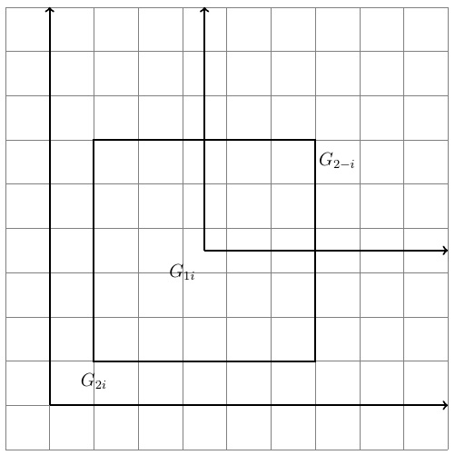
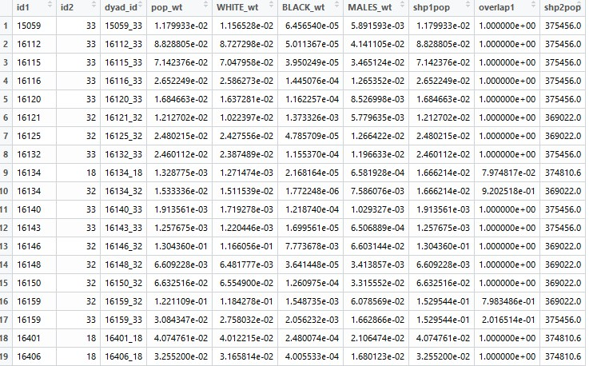
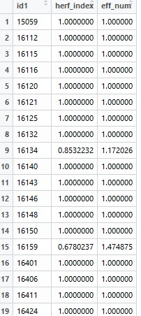
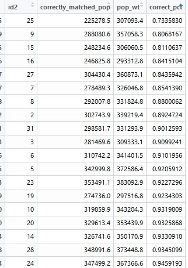

# arealOverlapr

The arealOverlapr package is designed to read in shapefiles and find their population weighted overlap. To use, please use the following code: 

## Install 

devtools::install_github("https://github.com/jcuriel-unc/arealOverlapr2",subdir="arealOverlapr")

library(arealOverlapr)

## Requirements 

In order to run the package, three shapefiles are necessary. Two of these shapefiles consist of the geographies that the user is interested in finding the overlap between. The third consists of the atomic-level Census geography. This should consist of a precise level of geography on par with Census blocks or block groups within the U.S. These shall act as a grid that informs the overlay between two actual shapefiles of interest. 

In the Figure above, we see how these shapefiles work together. Where the atomic file acts as a grid with weights associated with each grid unit, G1i reflects a polygon from the first shapefile, G2i a polygon from the second shapefile, and G2-i another polygon from the second shapefile. When a grid unit from the atomic file is not completely nested within the intersecting area between the two shapefiles of interest, only then is geographic overlap used to allocate the population information. The arealOverlapr process works by minimizing the degree to which geographic overlap and associated assumptions are employed to find the degree of similarity between two shapefiles. 

## Creating the spatial dyadic matrix 

The first step in order to run the script is to create a three-way dyadic overlap between the three shapefiles of interest. Within the package, this is done via the "weight_overlap" command. The command accepts the following arguments of shp1, shp_atom, shp2, crs1, crs2, and pop_field.

weight_overlap(
  shp1,
  shp_atom,
  shp2,
  crs1 = "+proj=laea +lat_0=10 +lon_0=-81 +ellps=WGS84 +units=m +no_defs",
  crs2 = "+init=epsg:2163",
  pop_field
)

shp1: Shapefile 1, of a SpatialPolygonsDataFrame object (sp)

shp2: Shapefile 2, of a SpatialPolygonsDataFrame object (sp)

shp_atom: Atomic grid shapefile, usually (and recommended) to be Census in origin; SpatialPolygonsDataFrame object (sp)

crs1: The projection for the files to be transformed into. Defaults to "+proj=laea +lat_0=10 +lon_0=-81 +ellps=WGS84 +units=m +no_defs" if no user change made. 

crs2: Projection modification if need arises; should take an epsg format for ease of areal coverage. Defaults to "+init=epsg:2163" if no user change is made. 

pop_field: The name of the field within the atomic spatail dataframe reflecting the population of each unit; must be in quotation marks. 

Example: 

zctas <- arealOverlapr::zctas #shapefile 1

cbg_oh <- arealOverlapr::cbg_oh#atomic level shapefile to act as grid 

oh_sen <- arealOverlapr::oh_sen#shapefile 2

test_overlap <-weight_overlap(shp1 = zctas, shp_atom = cbg_oh, shp2 = oh_sen, pop_field = "POP2010")

Upon running the weight_overlap command, the user will have a raw output of data frames from all three spatial dataframes merged together, in addition to the three-way intersection calculated. This output takes the form of a base R data frame. To clean the rest, the user must make use of overlap_dyad_creatr, which cleans up the output of the previous command. The output of this command will be the dyadic overlap and associated information between the first and second shapefiles alone. 

overlap_dyad_creatr(weight_output, id1, id2, census_fields)

weight_output: The output of the weight_overlap command, data.frame class. 
id1: The unique string/character ID from shapefile 1. 
id2: The unique string/character ID from shapefile 2. 
census_fields: Census fields from the atomic shapefile that should be aggregated to the level of shp1-shp2 dyads. 

Example: 

test_output <- overlap_dyad_creatr(test_overlap, id1="ZCTA5CE10",id2="id", census_fields = c("WHITE","BLACK","MALES"))

The outputted data frame is below. 

We see that the ID's and dyadic ID are present within the first three columns. The pop_wt field reflects the estimated population present within the intersection between the specified polygons from the first and second shapefiles. Note that the numbers have not been rounded. Additionally, should the user have specified any other census fields, then they will appear with the "-wt" tail in the column name. The shp1pop and shp2pop fields reflect the total population for the specified entire polygons for the first and second shapefiles respectively. The overlap1 field reflects the proportion of the first shapefile's specified polygon that is nested within the second shapefile. The field ranges from  0 to 1, where 1 equates to complete nesting within a single polygon from the second shapefile, and 0 equates to infinite splitting between the second level polygons.  

## Checking Results 

An important feature that most users of this package might want to know is the degree to which polygons from one of the levels of geography perfectly nest. This would take the form of the effective number of polygons from level 2 within level 1, or vice-versa. This can be accomplished with the "herfindahl_new" command. The command works by summing the squared overlap scores (on a 0 - 1 scale) for all components of a single level. The command takes the following arguments. 

herfindahl_new(overlap_dyad_output, pop_field, id1)

overlap_dyad_output: The output from the overlap_dyad_creatr command. 

pop_field: The name of the dyadic population field from the intersection of the two levels of geography; defaults to "pop_wt". 

id1: The name of the unique string/character ID field of interest; defaults to "id1"  

Example: 

test_herf <- herfindahl_new(test_output,"pop_wt",  "id1")

 
 The Figure below demonstrates the output of the command, with id1 reflecting the inputted ID, and the herfindahl index the degree of diversity across the second level of geography's polygons, with values approaching 0 equating to complete heterogenity/splits, and scores approaching 1 complete homogeneity/nestedness. The eff_num reflects the effective number of level 2 polygons within the level 1 polygons, which amounts to the inverse of the herfindahl index. These values have a floor of 1 and no upper limit. Note that scores above 1.333 should warrant caution for the ensuing commands (Steelman and Curiel, 2022) 
 
 
 
 
 
 ## Matching polygons to their best match
 
 Many scholars will want to use this package to perhaps assign the first level of geography to the second level that it has the best match with. For example, looking at maps of districts across time, some might use level 1 as the "parent" districts, and seek to identify the closest "child", which would consist of the ensuing district that comprises the highest degree of shared space, relative to others. Scholars interested in performing this should first run the aforementioned herfindahl_new command to ensure that the process is not too noisy. Upon doing so, the command "best_match_new" can accomplish this. The command works as follows, 
 
best_match_new(overlap_dyad_output, "id1")

overlap_dyad_output: The output from the overlap_dyad_creatr command.  

id1: The name of the unique string/character ID field of interest; defaults to "id1" 

The command slices the data by identifying the set of rows associated with a unique id name, and keeps the row with the maximum overlap1 score. Therefore, there is one row for every unique id1 value. 

Finally, the command "correct_match_shp2" informs the user of the accuracy of using the aforementioned method of a 1 to 1 match of the first level of geography to the second. The command works by allocating only the population of the wholly matched first level of geography to the second, with the output of percent accuracy. The command works as follows. 

correct_match_shp2(overlap_dyad_output,"id1",'id2')

overlap_dyad_output: The output from the overlap_dyad_creatr command. 

id1: The name of the unique string/character ID field of interest; defaults to "id1" 

id2: The name of the unique string/character ID field of interest; defaults to "id2" 

Upon running the command, the output will be as follows. 

 
 
The output informs the user of the "correctly_matched_pop" using the pluralistic 1 to 1 assignment mentioned above. The pop_wt field reflects the population estimated for the second level of geography from the atomic census units. The "correct_pct" is a 0-1 scale of the degree of accuracy. Scores should ideally be 1, and will be in the event that the second level of geography splits no first level units. Scores approaching 0 reflect complete uncertainty due to poor nestedness between the first and second levels of geography. Consistently low scoring polygons should be treated with extreme caution, and more nuanced approaches than a 1 to 1 match should be taken. 

 
